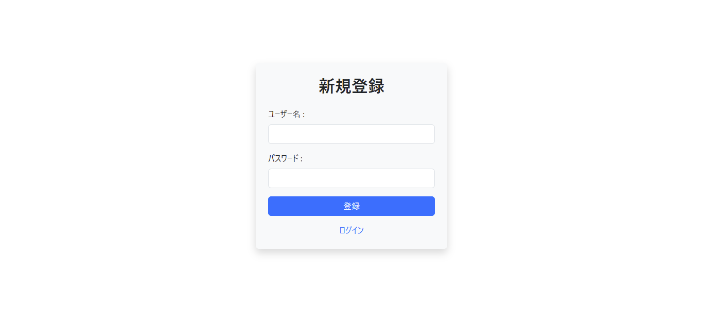
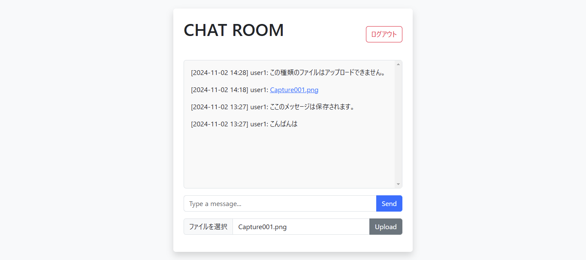

# ChatApp - Spring Boot Chat Application

---

## 概要

ChatApp は、Spring Boot を使用して開発されたリアルタイムチャットアプリケーションです。WebSocket を利用してユーザー同士のメッセージ送受信を可能にし、ファイルのアップロード・ダウンロード機能も備えています。

---

## 主な機能

- ユーザー認証（ログイン・ログアウト）
- WebSocket を用いたリアルタイムチャット
- メッセージのデータベース保存
- ファイルのアップロード・ダウンロード
- セキュリティ設定（Spring Security）

---

## 使用技術

- **バックエンド**: Java23, Spring Boot, WebSocket
- **データベース**: MySQL
- **ビルドツール**: Maven
- **フロントエンド**: HTML, CSS, JavaScript

---

## スクリーンショット

### ログインページ
ユーザーがアカウント情報（ユーザー名とパスワード）を入力し、「ログイン」ボタン をクリックしてログインします。

### 登録ページ
新規ユーザーは、ユーザー名、パスワードを入力し、「登録」ボタン をクリックすることでアカウントを作成できます。

### チャット画面
下部の入力フォームにメッセージを入力して 「Send」ボタン を押すとメッセージが送信されます。

### ファイルアップロード
「ファイルを選択」ボタン をクリックし、アップロードしたいファイルを選択します。その後、「Upload」ボタン をクリックするとファイルが送信されます。

---
